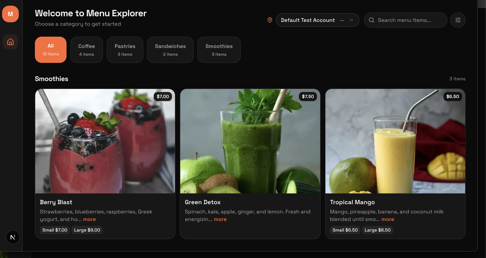
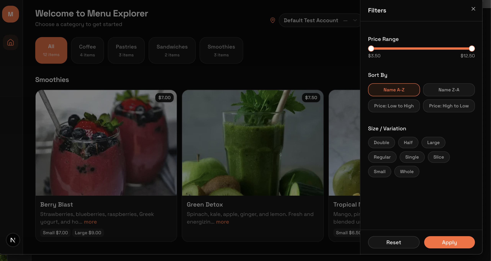
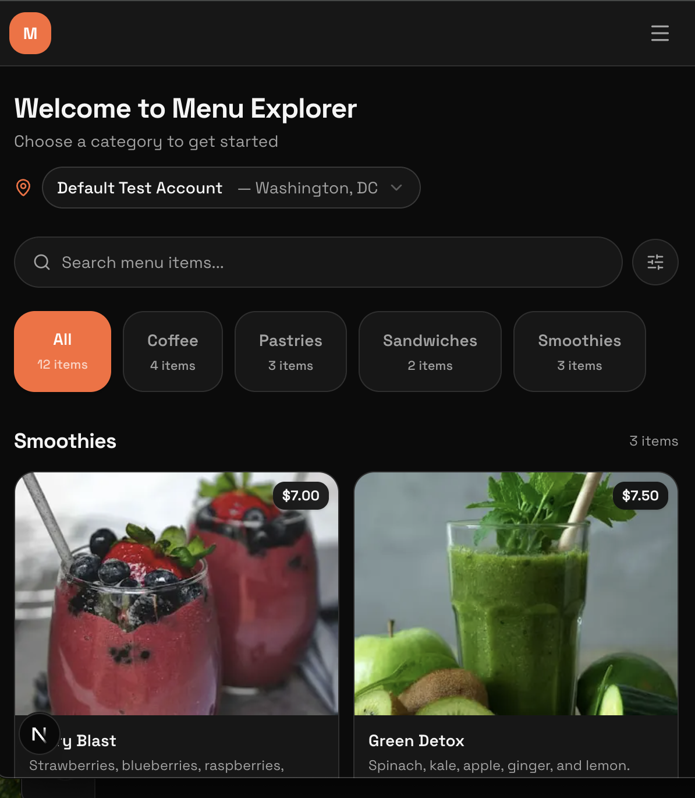
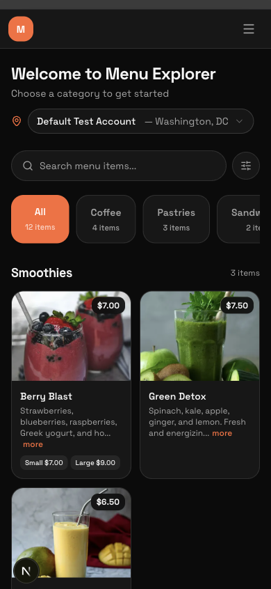

# Square Menu Explorer

A mobile-first menu viewer that pulls from the Square Catalog API. Pick a location, browse by category, search items — the usual stuff you'd expect from a restaurant menu app.

Built with Next.js 16, Tailwind v4, and a bunch of other good stuff. Themed to match Per Diem's brand.

## Stack

- **Next.js 16** (App Router) — handles both the API proxy and the frontend
- **TypeScript** (strict) — types everywhere
- **Tailwind CSS 4** + **shadcn/ui** — CSS-first config, no `tailwind.config.ts`
- **Framer Motion** — card entrance animations, animated category pill
- **TanStack Query** — client-side data fetching with stale-while-revalidate
- **Axios** — Square API calls from the backend, with error interceptor
- **Zod** — validates all Square responses before we touch them
- **Redis** (ioredis) — server-side caching with 5min TTL
- **next-themes** — dark mode
- **Vitest** + **Testing Library** + **Playwright** + **MSW** — full test coverage

## Setup

```bash
# 1. clone the repo
git clone https://github.com/macbrina/square-menu-explorer.git
cd square-menu-explorer

# 2. install
npm install

# 3. configure env
cp .env.example .env.local
# then add your Square sandbox token and base URL to .env.local

# 4. start redis (or skip — app works without it, just no caching)
docker run -d -p 6379:6379 redis:7-alpine

# 5. seed the sandbox with test menu data
npm run seed

# 6. run
npm run dev
```

Open http://localhost:3000.

### Docker

```bash
docker-compose up --build
```

Spins up the Next.js app + Redis in **production mode**. Code changes require a rebuild (`docker-compose up --build`). For development with hot reload, use `npm run dev` instead.

> **Note:** Docker Compose resolves `${}` variables in the compose file from a `.env` file (not `.env.local`). A symlink is included: `.env → .env.local`. If you remove it, create one with `ln -sf .env.local .env` or Compose will warn about missing variables during the build.

### Vercel

```bash
npm i -g vercel
vercel
```

Add your env vars in the Vercel dashboard (Settings → Environment Variables). For Redis, use [Upstash](https://upstash.com) (free tier) and set `REDIS_URL` to the connection string. If you skip Redis, the app still works — just no caching.

## How it works

### Backend

Three API routes proxy calls to Square so the access token never hits the client:

- `GET /api/locations` — active locations only
- `GET /api/catalog?location_id=` — items with pagination, filtered by location, grouped by category
- `GET /api/catalog/categories?location_id=` — categories with item counts

All `/api/*` routes are protected by an API key middleware (`x-api-key` header). If `API_KEY` isn't configured, auth is skipped so local dev works out of the box. The webhook endpoint is excluded — it uses its own HMAC signature verification.

Each route: logs the request → checks Redis → calls Square if cache miss → validates with Zod → transforms to our types → caches → responds. Errors are intercepted by Axios and mapped to a clean `{ error: { code, message } }` shape.

There's also a `POST /api/webhooks/square` endpoint that listens for `catalog.version.updated` events and busts the relevant cache keys (using SCAN, not KEYS — won't block Redis).

#### Webhook setup (optional)

To get real-time cache invalidation when the catalog changes in Square:

```bash
# 1. expose your local server
brew install ngrok   # or https://ngrok.com/download
ngrok http 3000

# 2. copy the https URL ngrok gives you (e.g. https://abc123.ngrok-free.app)
```

Then in the [Square Developer Dashboard](https://developer.squareup.com/apps):

1. Open your app → **Webhooks** → **Add subscription**
2. **URL:** `https://YOUR_NGROK_URL/api/webhooks/square`
3. **Events:** check `catalog.version.updated`
4. Save

5. Copy the **Signature Key** from the subscription and add it to `.env.local`:
   ```
   SQUARE_WEBHOOK_SIGNATURE_KEY=your_signature_key_here
   ```

The webhook endpoint verifies the `x-square-hmacsha256-signature` header on every request using HMAC-SHA256 (constant-time comparison). If no signature key is configured, verification is skipped so local development still works.

Now any catalog change (add/edit/delete items) will automatically bust the Redis cache. You can verify it works:

```bash
# load the app first to populate cache, then:
curl -X POST http://localhost:3000/api/webhooks/square \
  -H "Content-Type: application/json" \
  -d '{"type": "catalog.version.updated"}'
# should return {"ok":true,"invalidated":{"catalog":1,"categories":1}}
```

### Frontend

TanStack Query handles all data fetching with automatic retry and loading/error states. Selected location is persisted in localStorage. Search is client-side — filters the already-fetched items by name or description.

The category nav has a spring-animated pill that slides between tabs (framer-motion layoutId). Menu cards stagger in on load.

### Theming

Per Diem's brand color (`#ff6b35`) is wired through shadcn's CSS variable system for both light and dark modes. Font is Space Grotesk. Everything lives in `src/styles/globals.css` using Tailwind v4's `@theme inline {}` — no JS config.

## Testing

```bash
npm test              # unit + integration (vitest)
npm run test:watch    # watch mode
npm run test:e2e      # e2e (playwright, needs dev server running)
```

| Type        | Tool                     | Coverage                                               |
| ----------- | ------------------------ | ------------------------------------------------------ |
| Unit        | Vitest                   | utils, error mapping, zod schemas                      |
| Integration | Vitest + Testing Library | SearchBar, ErrorState components                       |
| E2E         | Playwright               | page load, location selection, dark mode, keyboard nav |

## What's covered from the bonus list

- Redis caching with webhook-based cache invalidation
- Client-side search/filter
- Framer Motion animations
- Dark mode toggle
- Docker support
- Accessibility (skip link, ARIA, keyboard nav, screen reader live regions)
- Per Diem brand theming

## Screenshots

| Desktop                                    | Desktop (Filters)                                         |
| ------------------------------------------ | --------------------------------------------------------- |
|  |  |

| Tablet                                   | Mobile                                   |
| ---------------------------------------- | ---------------------------------------- |
|  |  |

## Trade-offs

- **Next.js API routes vs standalone server** — went with API routes to keep everything in one repo and one deploy. Trade-off is tighter coupling, but for this scope it keeps things simple and the routes are isolated enough to extract later.
- **Redis vs in-memory cache** — Redis adds a dependency but survives restarts and can be shared across instances. Made it optional so the app still works without it (just no caching).
- **Client-side filtering vs server-side** — search, price range, sort, and size filters all run client-side on already-fetched data. For a catalog of this size that's fine and feels instant. Wouldn't scale to thousands of items — at that point you'd push filters to the API.
- **TanStack Query vs SWR** — went with TanStack Query for better devtools and built-in retry/refetch control. SWR would've been lighter but less flexible.
- **Zod validation on every response** — adds a small overhead per request, but catches schema drift early. Worth it for a third-party API that could change.
- **`object_types: ["ITEM", "CATEGORY"]`** — the spec says `["ITEM"]` with `include_related_objects`, but fetching categories as first-class objects gave more reliable category data for the categories endpoint. Related objects don't always include all category fields.

## Limitations

- Sandbox only — flip `SQUARE_ENVIRONMENT=production` for real data
- Redis is optional — without it, every request hits Square directly
- API key auth is lightweight — in production, swap for OAuth/JWT/session-based auth depending on the consumer (merchants, end-users, internal services)
- Square image CDN domains (sandbox + production) are already whitelisted in `next.config.ts` `remotePatterns`. If Square adds a new CDN hostname, you'd need to add it there
